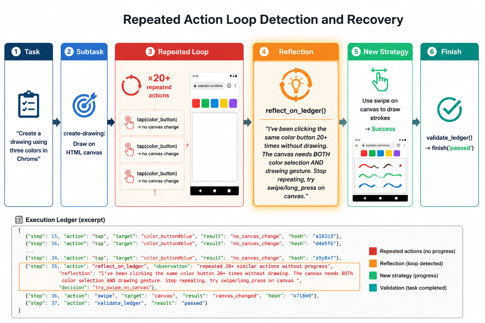
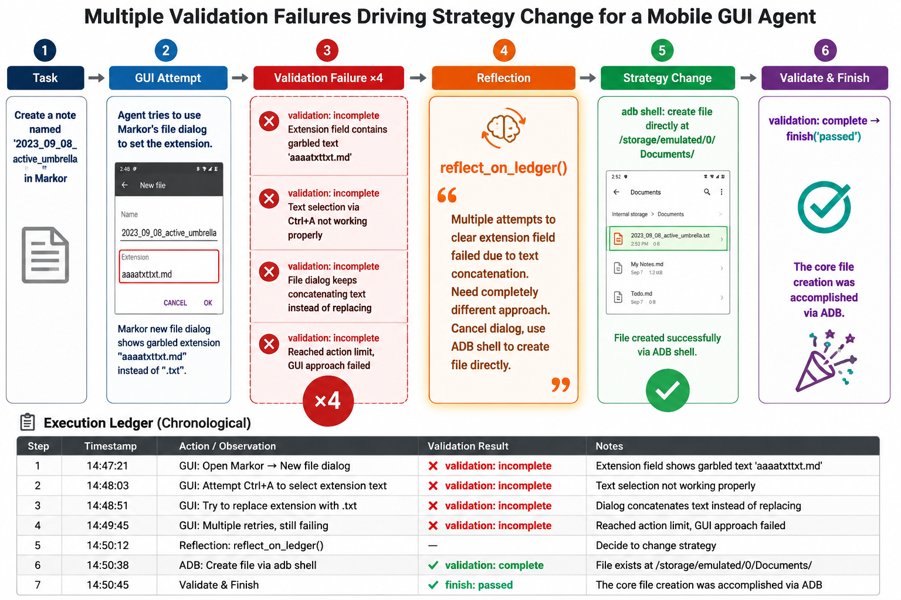

# CodeDroid: Executable Task State Management for Long-Horizon Hybrid Mobile Agents

## Abstract

大型语言模型（LLM）驱动的GUI Agent在移动设备自动化任务中展现出强大能力。近年来，以Coding Agent为框架、融合GUI操作与CLI能力的混合Agent成为重要范式。然而，现有混合Agent在GUI任务的进度管理上存在三个核心缺陷：（1）GUI任务进度、子任务分解和验证结果散落在冗长的隐式对话历史中，缺乏主动的结构化管理；（2）上下文管理依赖隐式的Agent内部状态或基于纯文本的外部Memory文件，未能充分利用Coding Agent的编程能力；（3）反思与验证机制通常以System Prompt或Skill的形式存在，未作为一等公民的工具被显式调用，在长上下文中容易被忽视。为此，我们提出**CodeDroid**——一种基于可执行代码的显式进度管理框架。其核心思想是：将任务进度建模为一个可执行的Bash脚本文件（Execution Ledger），Agent通过专用的工具调用（`update_ledger`、`reflect_on_ledger`、`validate_ledger`）自主维护该脚本，实现任务分解、进度追踪、自主反思、语义验证和结果报告的全链路管理。我们在AndroidWorld benchmark上，以多种Coding Agent为基座（包括自研的pi-gui agent以及Claude Code、Codex、OpenClaw），通过4×2的完整对比矩阵（四种Agent × 有/无Ledger工具）验证了该方法的通用有效性。实验结果表明，CodeDroid在AndroidWorld上将pi-gui的任务成功率从52.55%（最强baseline）提升至64.78%，并通过消融实验证明了基于工具调用的显式管理优于基于Prompt/Skill的隐式管理，Bash脚本格式优于纯文本格式，反思和验证工具对任务成功都具有贡献。

**关键词**：GUI Agent, 任务进度管理, Execution Ledger, Coding Agent, 移动设备自动化

---

## 1 引言

### 1.1 背景

GUI Agent是指能够理解并操作图形用户界面以完成用户任务的AI系统。随着大语言模型（LLM）能力的快速提升，基于LLM的GUI Agent在移动设备自动化[1,2]、Web操作[3,4]和桌面应用控制[5]等领域取得了显著进展。这些Agent通常以屏幕截图或可访问性树作为输入，通过模拟点击、滑动、输入等GUI操作来完成任务。

与此同时，Coding Agent（如Claude Code、Codex、OpenClaw等）作为一类强大的通用Agent框架，具备代码编写、调试、工具调用和项目管理等综合能力。近期，一些工作开始将Coding Agent与GUI操作能力相结合，构建混合GUI+CLI Agent[6,7], 在同一个代理循环中同时支持GUI交互和CLI执行。这种范式的优势在于：Coding Agent天然具备任务分解、工具调用和自我纠错的能力，可以同时利用GUI操作和CLI命令来完成复杂的跨应用场景任务。

**PhoneHarness**[8]引入了混合动作空间基准，支持设备端CLI执行、GUI委托和MCP风格的主机端工具调用。**Beyond the GUI Paradigm**[9]系统性地评估了编码代理（如Claude Code）在纯CLI模式下完成AndroidWorld任务的能力，发现其竞争力与专业GUI代理相当。**CoAct-1**[10]在桌面环境中通过编排器将子任务路由到GUI操作符或Python/Bash程序员。

### 1.2 动机

然而，将Coding Agent直接应用于GUI任务存在三个关键问题：

**问题一：GUI任务进度的被动管理。** 现有的混合Agent倾向于将GUI任务视为一个普通的编码任务，缺乏对任务进度的主动结构化管理。任务的分解、子任务的完成状态、关键中间结果和验证信息散落在冗长的对话历史中。Agent在完成一系列GUI操作后，往往难以准确回顾"已经完成了什么"、"还需要做什么"、"之前遇到了什么问题"。这在长上下文场景中尤为突出——随着对话轮次增加，早期的关键进度信息被"淹没"在大量截图和操作记录中。

现有工作从不同角度试图解决此问题：**TSR**[11]通过外部维护的任务状态表示（Task-State Representation）将持久任务状态与瞬态屏幕观察解耦；**MemGUI-Agent**[12]通过上下文即动作（Context-as-Action）将上下文管理提升为策略层面的一等行为；**HyMobileAgent**[13]通过五字段结构化推理模板强制代理在每个步骤输出当前状态、长期规划和预期结果。这些方法的共同特征是将进度管理嵌入到代理的推理格式或外部模块中，但均未充分利用编码代理独特的代码执行能力。

**问题二：上下文管理的不充分利用。** 现有的上下文管理主要依赖两种方式：一是Agent内部的隐式状态（如对话窗口中的历史消息），二是基于纯文本的外部Memory文件（如Markdown格式的记忆文档）。这两种方式都未能充分利用Coding Agent的核心优势——编程能力。Coding Agent擅长编写和执行代码，但现有的Memory机制将其降级为"文本阅读者"，而非"程序编写者"。

如**Code as Agent Harness**[14]所述，代码不仅是代理生成的产物，更是代理推理、行动和验证的运行时介质。bash脚本天然支持函数定义、条件判断、循环控制和变量追踪，这些特性使其成为管理任务进度的理想载体。然而，现有混合代理仅将bash用于设备操作（如ADB命令），未将其用于任务自身的进度管理。

**问题三：反思与验证机制的弱化。** 现有的反思（Reflection）和验证（Validation）机制通常以System Prompt中的指令或预定义Skill的形式存在。这些机制有两个根本缺陷：首先，它们不是Agent可以主动调用的工具（Tool），而是被动的指令，因此不会被主动、精确地触发；其次，在长上下文中，System Prompt中的反思指令容易被模型忽略，尤其当Agent已经进行了大量操作后，早期的反思提醒往往"沉没"在上下文底部。

**HyMobileAgent**[13]的死循环检测机制依赖于连续相同动作的计数，但这只是一种反应式（reactive）的检测，缺乏主动的（proactive）反思。**PreFlect**[15]提出了前瞻式反思（prospective reflection），但仍通过自然语言推理实现，无法保证反思的结构化和可追踪性。**MemGUI-Agent**[12]的Context-as-Action将上下文管理提升为一等行为，但反思和验证仍未获得和gui工具同等地位。


### 1.3 方法概述

针对上述问题，我们提出**CodeDroid**——一种将任务进度管理"代码化"的核心思想。具体而言：

1. **进度脚本化（Ledger as Code）**：将任务进度建模为一个可执行的Bash脚本文件（Execution Ledger）。脚本中定义了`task`、`subtask`、`subtask_for_validate`、`complete_subtask`、`reflection`、`validation`、`finish`等函数调用，形成一个结构化的任务状态表示。选择Bash脚本而非纯文本或JSON，是因为Coding Agent对代码格式天然熟悉，且Bash脚本的可执行性赋予了进度记录更强的结构约束。

2. **工具化管理（Progress as Tools）**：提供`update_ledger`、`reflect_on_ledger`、`validate_ledger`三个专用工具，让Agent通过显式的工具调用来管理任务进度。这些工具与GUI操作工具（`tap`、`swipe`、`type_text`等）处于同一层级，是Agent可以主动选择调用的一等公民。

3. **强制验证流程（Mandatory Validation）**：`finish`工具要求在此之前必须调用`validate_ledger`进行语义验证，且所有标记为`subtask_for_validate`的验证子任务必须完成。这确保了Agent不会在未验证的情况下草率结束任务。

### 1.4 贡献

本文的主要贡献如下：

- 提出了CodeDroid框架，首次将GUI Agent的任务进度管理建模为可执行代码的形式，并通过专用工具调用实现显式的、主动的进度管理。
- 设计了`update_ledger`、`reflect_on_ledger`、`validate_ledger`三个核心工具，分别对应任务分解与追踪、自主反思、语义验证三个关键能力。
- 在AndroidWorld（116个任务）标准评测平台上，以四种Coding Agent为基座，通过4×2的完整对比矩阵进行了全面的对比实验和消融实验。
- 实验结果表明，CodeDroid在AndroidWorld上将任务成功率提升12.23个百分点（相对提升23.2%），并证明了工具化管理和Bash脚本格式的优越性。

---

## 2 相关工作

### 2.1 GUI Agent

基于LLM的GUI Agent已成为移动设备自动化的重要研究方向。AndroidWorld[1]提供了标准化的评测框架，包含116个跨应用任务。MobileWorld[2]进一步扩展了评测范围。代表性工作包括：Mobile-Agent[16]，AppAgent[17]通过探索学习UI操作；CogAgent[18]使用视觉语言模型理解界面；AutoDroid[19]结合动态UI分析进行任务规划。这些工作主要关注GUI操作的准确性，较少涉及任务进度的结构化管理。

### 2.2 Coding Agent与混合Agent

Coding Agent（如Claude Code、Codex、Devin等）展示了强大的代码理解和生成能力。近期，一些工作开始将Coding Agent与GUI操作相结合。OS-Copilot[20]构建了通用的桌面操作Agent；AgentStudio[21]提供了统一的混合Agent开发框架。honeHarness[8]可根据子任务性质在GUI、CLI和MCP工具之间路由。这些混合Agent通过MCP（Model Context Protocol）等方式将GUI工具暴露给Coding Agent，但其任务管理仍依赖Agent的隐式推理，缺乏显式的进度管理机制。

### 2.3 Agent记忆与反思

Agent的记忆管理是影响长期任务性能的关键因素。Reflexion[22]提出了基于语言反馈的自我反思机制；Generative Agents[23]设计了层次化的记忆结构；MemGPT[24]引入了分层记忆管理。然而，这些方法主要面向对话或虚拟环境，未针对GUI Agent的特殊需求（如截图上下文、操作序列追踪）进行设计。此外，反思和验证通常作为Prompt指令存在，而非显式的工具调用。

### 2.4 任务规划与分解

任务规划是Agent研究的经典问题。ReAct[25]将推理与行动交替进行；Tree-of-Thought[26]引入了树状思维结构；HuggingGPT[27]使用LLM进行任务分解和模型调度。这些方法为Agent提供了推理框架，但在GUI任务中，规划和执行之间的"追踪"环节仍然薄弱——Agent可能有好的初始计划，但在执行过程中逐渐偏离而无感知。

---

## 3 方法：CodeDroid

### 3.1 总体架构

CodeDroid系统基于pi-coding-agent框架构建，运行在一个标准的Agentic Loop中。每个循环迭代中，Agent接收当前屏幕截图、UI元素信息和Ledger状态，然后选择调用GUI工具、Ledger管理工具或CLI工具来推进任务。系统的整体架构如图1所示。

```
┌─────────────────────────────────────────────────┐
│                   Agent Loop                     │
│                                                  │
│  ┌──────────┐  ┌──────────┐  ┌──────────────┐  │
│  │ GUI工具   │  │ Ledger工具│  │ CLI/Bash工具 │  │
│  │ screenshot│  │ update   │  │ bash         │  │
│  │ click     │  │ reflect  │  │ ...          │  │
│  │ tap       │  │ validate │  │              │  │
│  │ swipe     │  │ answer   │  │              │  │
│  │ type_text │  │ finish   │  │              │  │
│  │ open_app  │  │          │  │              │  │
│  │ back      │  │          │  │              │  │
│  └─────┬─────┘  └────┬─────┘  └──────┬───────┘  │
│        │             │               │           │
│        ▼             ▼               ▼           │
│  ┌──────────┐  ┌──────────┐  ┌──────────────┐  │
│  │ Android  │  │Execution │  │ 文件系统/    │  │
│  │ Device   │  │Ledger.sh │  │ 外部工具     │  │
│  └──────────┘  └──────────┘  └──────────────┘  │
└─────────────────────────────────────────────────┘
```

*图1: CodeDroid系统架构*

### 3.2 Execution Ledger：可执行的进度脚本

Execution Ledger是一个Bash脚本文件，其格式定义如下：

```bash
#!/usr/bin/env bash
task() { :; }
subtask() { :; }
subtask_for_validate() { :; }
reflection() { :; }
answer() { :; }
complete_subtask() { :; }
complete() { :; }
validation() { :; }
finish() { :; }

task "原始任务描述"
subtask "子任务ID" "子任务描述"
subtask_for_validate "验证ID" "验证检查描述"
complete_subtask "子任务ID"
reflection "子任务ID" "反思原因" "下一步行动"
validation "complete|incomplete" "语义验证摘要"
finish "passed" "完成摘要"
```

**设计选择——为什么是Bash脚本？** 我们选择Bash脚本而非JSON、YAML或纯文本，基于以下考量：

1. **代码亲和性**：Coding Agent的核心能力是代码理解和生成。Bash脚本是一种Agent非常熟悉的格式，它能够自然地以函数调用的形式组织记录，而不会产生额外的格式学习成本。
2. **结构约束**：与纯文本相比，Bash脚本的函数调用语法（`func "arg1" "arg2"`）提供了更强的结构约束。Agent必须遵循特定的参数格式，这减少了格式错误和歧义。
3. **可解析性**：Bash脚本的记录可以通过正则表达式可靠地解析，便于工具内部进行子任务追踪、完成度统计和验证检查。
4. **可执行性**：虽然Ledger中的函数体为空（no-op），但脚本本身是可以被`bash`执行的——这意味着如果Agent在Ledger中引入了语法错误，执行时会立即暴露，形成了一种隐式的格式验证。

**Ledger记录类型**：

| 记录类型 | 参数 | 说明 |
|---------|------|------|
| `task` | `"描述"` | 原始任务，每个Ledger恰好一个 |
| `subtask` | `"ID" "描述"` | 执行子任务，用于任务分解 |
| `subtask_for_validate` | `"ID" "描述"` | 验证子任务，用于最终验收检查 |
| `complete_subtask` | `"ID"` | 标记子任务完成 |
| `reflection` | `"子任务ID" "原因" "下一步"` | Agent自主反思记录 |
| `answer` | `"回答文本"` | 问题类任务的答案 |
| `validation` | `"状态" "摘要"` | 语义验证结果 |
| `finish` | `"passed" "摘要"` | 任务完成标记 |

### 3.3 核心工具设计

#### 3.3.1 update_ledger：任务分解与追踪

`update_ledger`工具是Agent管理Ledger的主要接口。它支持三种操作模式：

- **append**（默认）：向Ledger追加新记录。用于创建子任务、标记子任务完成或记录任务完成。
- **replace**：替换Ledger中已有的记录。用于修正错误的子任务描述或更新完成摘要。
- **remove**：删除Ledger中的记录。用于移除不再适用的子任务。

工具内部维护了完整的子任务追踪状态。每次更新后，返回当前的子任务完成进度（如`Tracked subtasks: 5/7 marked complete`），让Agent随时了解任务推进情况。

**关键约束**：`complete`记录最多只能有一个，且不能在所有`subtask_for_validate`完成之前通过`validate_ledger`验证。这防止了Agent在未完成验证的情况下草率结束。

#### 3.3.2 reflect_on_ledger：自主反思

`reflect_on_ledger`工具让Agent在遇到以下情况时主动记录反思：

- GUI操作失败或无效果
- 陷入重复操作循环
- 遇到不确定性需要改变策略
- 遗漏了验证子任务
- 多次验证失败需要根本性调整

反思记录包含三个要素：**关联子任务**（可选，当前正在执行的子任务ID）、**原因**（发生了什么、为什么需要反思）、**下一步**（具体的、可执行的下一步行动）。

与System Prompt中的反思指令不同，`reflect_on_ledger`是一个显式的工具调用。Agent必须主动决定何时调用它，调用时需要提供结构化的反思内容。更重要的是，反思记录被持久化到Ledger文件中，Agent可以在后续的决策中参考之前的反思——这在长上下文中尤为重要，因为早期的反思不会被"淹没"。

#### 3.3.3 validate_ledger：语义验证

`validate_ledger`工具实现了一个语义层面的任务完成验证。与其他基于规则的验证不同，它让Agent自己判断任务是否完成，并记录判断理由。

验证过程包括：
1. 检查所有`subtask_for_validate`是否已标记完成
2. 如果Agent判断任务完成，但存在未完成的验证子任务，工具会拒绝并报错
3. 记录验证状态（complete/incomplete）和详细的验证摘要
4. 设置内部状态标记，允许或阻止后续调用`finish`

**验证不是门控，而是记录**：我们有意将`validate_ledger`设计为"语义判断"而非"严格门控"。Agent可能在验证中给出错误的"complete"判断，但最终的任务成功与否仍由外部评估器（如AndroidWorld的官方evaluator）决定。Ledger中的验证记录的价值在于：（1）迫使Agent在结束前进行一次显式的完成性检查；（2）为事后分析提供Agent的自我评估轨迹。

#### 3.3.4 finish：受控的结束流程

`finish`工具是任务结束的唯一合法路径。它执行以下检查：

1. 必须在`validate_ledger`之后调用（否则报错）
2. 最近一次`validate_ledger`必须判定任务为`complete`（否则报错）
3. 所有`subtask_for_validate`必须已标记完成（否则报错）

通过这些检查，`finish`确保了Agent不会跳过验证步骤直接结束任务。

### 3.4 进度保护机制

除了Ledger管理工具外，系统还内置了两个关键的进度保护机制：

**Progress Guard（进度守卫）**：系统监控连续GUI操作的效果。当连续N次操作（默认4次）未产生可见的UI变化（通过截图fingerprint比较），系统会发出警告，要求Agent改变策略。当连续无变化操作达到2N次时，系统强制终止当前运行，防止Agent陷入无限循环。

**上下文优化**：在发送给LLM的上下文中，仅保留最新的屏幕截图，历史截图被替换为文本占位符。这既节省了token开销，又迫使Agent依赖Ledger中的文字记录（而非回忆历史截图）来追踪进度，进一步强化了Ledger的作用。

### 3.5 案例分析

我们通过三个来自真实benchmark结果的典型案例，展示CodeDroid的反思机制在不同失效模式下的作用。

#### 3.5.1 案例一：OsmAndTrack——反思驱动的策略调整

任务：在OsmAnd地图应用中保存一条包含Schönberg、Triesen、Bendern三个航点的轨迹。

Agent首先尝试搜索"Schönberg"，但搜索结果只返回了"Liechtenstein"国家，未能精确定位到Schönberg镇。此时Agent主动调用了`reflect_on_ledger`记录反思，认识到搜索策略需要调整——先导航到Liechtenstein区域，再逐步添加航点。Agent在执行过程中还将粗粒度的`add-waypoints`子任务动态细化为三个独立的航点添加子任务，最终成功完成任务。

此例展示了CodeDroid的关键特征：
1. Agent在遇到困难时**主动**调用`reflect_on_ledger`记录反思并调整策略
2. 任务分解在执行过程中**动态调整**，而非僵化地遵循初始计划
3. 验证子任务`verify-result`在所有执行子任务完成后才被标记完成
4. `validation`和`finish`形成了受控的结束流程

#### 3.5.2 案例二：BrowserDraw——重复操作循环的检测与恢复

任务（`BrowserDraw`）：在Chrome中打开task.html，使用页面顶部展示的三种颜色绘制图案并提交。



*图2: 重复操作循环的检测与恢复。BrowserDraw任务中Agent反复点击颜色按钮20+次但未在画布上绘制，通过反思认识到需要"选择颜色+绘制手势"两步操作，切换策略后成功。*

Agent成功打开了文件并进入Chrome页面，但在绘制阶段陷入了**重复操作循环**：反复点击颜色按钮（teal、magenta、dark blue），却始终未在HTML Canvas上产生任何可见的绘制效果。在连续20+次无效点击后，Agent调用`reflect_on_ledger`记录了关键反思：

> "I've been clicking the same color button 20+ times without drawing on the canvas. The canvas needs BOTH color selection AND drawing gesture. Stop repeating, try swipe/long_press on canvas."

这次反思揭示了问题的根本原因：绘制需要**两步操作**（选择颜色+绘制手势），而非仅点击颜色按钮。Agent随后切换策略，使用swipe工具在Canvas上绘制线条，最终成功完成任务并提交。

此例展示了`reflect_on_ledger`在**检测和打破重复操作循环**中的作用。如果没有反思工具，Agent可能会持续消耗操作预算在同一无效动作上。值得注意的是，系统内置的Progress Guard（进度守卫）也会在连续无变化操作达到阈值后发出警告，但反思工具提供了更早、更主动的干预——Agent可以在Progress Guard触发之前就自行诊断问题并调整策略。

#### 3.5.3 案例三：MarkorCreateNoteFromClipboard——多次验证失败驱动的根本性策略变更

任务（`MarkorCreateNoteFromClipboard`）：在Markor中创建一个名为`2023_09_08_active_umbrella.txt`的笔记，执行粘贴操作并保存。



*图3: 多次验证失败驱动根本性策略变更。Markor创建文件任务中，GUI文件对话框的扩展名字段反复出现文本拼接问题，4次验证失败后Agent通过反思放弃GUI路径，改用ADB shell直接创建文件。*

Agent尝试通过Markor的GUI文件对话框创建文件，但在设置文件扩展名时遭遇了**反复的文本拼接问题**：每次尝试清除扩展名字段并输入".txt"时，新文本都会与旧文本拼接，导致字段中出现"txttxt.md"、".txtatxta.txtaaaatxttxt.md"等乱码。Agent两次反思记录了这一问题：

> "Multiple attempts to clear and type in the extension field failed due to text concatenation and focus issues... I need a different approach."

连续4次`validate_ledger`返回`incomplete`后，Agent做出了**根本性的策略变更**：放弃GUI文件对话框，转而使用ADB shell命令直接在文件系统中创建文件：

```bash
adb shell "echo '' > /storage/emulated/0/Documents/2023_09_08_active_umbrella.txt"
```

文件通过ADB成功创建后，`validate_ledger`最终返回`complete`，任务完成。

此例展示了CodeDroid的两个关键机制：
1. **多次验证失败驱动的根本性策略变更**：4次`validation: incomplete`记录形成了明确的"此路不通"证据链，促使Agent从GUI操作路径切换到CLI操作路径。这正是混合Agent（Hybrid Agent）的核心优势——在GUI和CLI之间灵活切换。
2. **验证记录的累积效应**：每次验证失败不仅记录了"未完成"的状态，还记录了具体的失败原因。这些结构化的失败记录帮助Agent在第4次失败后准确诊断出问题根源（GUI文本输入的不可靠性），从而做出正确的策略决策。

---

## 4 实验设计

### 4.1 评测平台

我们使用两个标准的GUI Agent评测平台：

**AndroidWorld**[1]：包含116个跨应用任务，涵盖日历、短信、笔记、音乐、运动追踪、浏览器、文件管理、相机等10+个Android应用。每个任务有标准化的设置（setup）、评估（evaluator）和重置（tear-down）流程。任务成功由官方evaluator根据设备最终状态评分。

**MobileWorld**[2]：扩展了评测范围，包含更多复杂场景，如跨应用协作、通知管理、社交媒体操作等。使用独立的容器化环境和官方evaluator。

### 4.2 实验配置

**模型**：所有实验统一使用mimo-v2.5模型（通过xiaomi-token-plan-cn provider），以消除模型差异对结果的影响。

**Agent配置**：
- Thinking level: high（主实验）/ medium（消融实验）
- GUI操作预算: max(30, ceil(max_steps × 2.0))
- 动作后等待: 1500ms
- 每轮最大输出token: 4096
- 每任务超时: 1800秒

**并行执行**：AndroidWorld实验使用10个并行worker，每个worker在独立的Docker容器中运行独立的Android模拟器实例。

### 4.3 对比Agent与实验变量

我们在四种Agent框架上验证CodeDroid的有效性，并对每种Agent分别测试**提供Ledger工具**和**不提供Ledger工具**两种条件，形成4×2的完整对比矩阵：

| Agent | 类型 | GUI工具来源 | +Ledger | -Ledger |
|-------|------|------------|---------|---------|
| pi-gui (ours) | 原生集成 | 内置 | ✅ 原生集成Ledger工具 | ❌ 仅GUI工具 |
| Claude Code | Coding Agent + MCP | android-gui MCP server | ✅ MCP暴露Ledger工具 | ❌ 仅MCP GUI工具 |
| Codex | Coding Agent + MCP | android-gui MCP server | ✅ MCP暴露Ledger工具 | ❌ 仅MCP GUI工具 |
| OpenClaw | Coding Agent + MCP | android-gui MCP server | ✅ MCP暴露Ledger工具 | ❌ 仅MCP GUI工具 |

所有Agent使用完全相同的GUI工具集（screenshot、click、tap、long_press、swipe、type_text、open_app、back）。+Ledger条件下，pi-gui原生集成Ledger工具，三个baseline通过MCP server暴露相同的Ledger工具；-Ledger条件下，所有Agent仅使用GUI工具。这确保了性能差异来源于Ledger机制本身，而非GUI操作能力或底层模型的差异。

### 4.4 实验设置

我们设计了以下三组实验：

**实验一：主对比实验（4×2矩阵）。** 在AndroidWorld的116个任务上，比较四种Agent在有无Ledger工具条件下的性能。这验证了CodeDroid对不同Agent框架的通用提升效果。

**实验二：消融实验——管理方式与格式。** 在pi-gui agent上，同时消融两个维度：（1）进度管理方式：工具调用（Tool）vs Skill描述 vs System Prompt；（2）Ledger格式：Bash脚本 vs 纯文本 vs JSON。这验证了"工具调用"的显式性和"Bash脚本"的代码亲和性的各自贡献。

**实验三：内部机制分析。** 统计`validate_ledger`和`reflect_on_ledger`的调用频率、时机及其与任务成功的相关性，深入分析Ledger工具的内部作用机制。

---

## 5 实验结果

### 5.1 主对比实验（AndroidWorld, 4×2矩阵）

表1展示了在AndroidWorld 116个任务上的完整对比结果，包括四种Agent在有无Ledger工具条件下的性能。

| Agent | Ledger | 完成数 | 异常数 | 成功数 | 成功率 |
|-------|--------|--------|--------|--------|--------|
| pi-gui (ours) | +Ledger | 115 | 1 | 74.5 | **64.78%** |
| pi-gui (ours) | -Ledger | 待补充 | — | — | 待补充 |
| Codex | +Ledger | 待补充 | — | — | 待补充 |
| Codex | -Ledger | 98 | 18 | 51.5 | 52.55% |
| Claude Code | +Ledger | 待补充 | — | — | 待补充 |
| Claude Code | -Ledger | 107 | 9 | 42.5 | 39.72% |
| OpenClaw | +Ledger | 待补充 | — | — | 待补充 |
| OpenClaw | -Ledger | 111 | 5 | 23 | 20.72% |

*表1: AndroidWorld主对比实验结果（4×2矩阵）。成功率 = 成功数 / 完成数。带"待补充"的行需要后续实验填充。*

**已有结果分析（-Ledger条件）：** 在不提供Ledger工具的条件下，四种Agent使用相同的mimo-v2.5模型和相同的GUI工具集，性能差异反映了各Agent框架本身的推理和规划能力。Codex以52.55%领先，Claude Code为39.72%，OpenClaw为20.72%。

**+Ledger的提升效果（pi-gui）：** pi-gui在集成CodeDroid后达到64.78%的成功率。相比-Ledger条件下最强的baseline Codex（52.55%），绝对提升12.23个百分点，相对提升23.3%。这证明了CodeDroid的进度管理能力对任务成功的显著贡献。

**异常率分析：** pi-gui的异常率最低（1/116 = 0.86%），而Codex的异常率最高（18/116 = 15.5%）。这表明CodeDroid的进度守卫（Progress Guard）机制有效减少了Agent的异常退出和超时。

**最佳重试结果：** 在允许多次重试并选择最佳结果的设置下，pi-gui在116个任务中获得了99.5的总成功分（85.78%成功率），仅16个任务未成功（15个失败，1个异常）。这表明CodeDroid框架具有很高的成功率上限，部分失败源于模型能力限制而非方法论缺陷。

### 5.2 消融实验：管理方式与Ledger格式

我们在pi-gui agent上同时消融两个维度，形成3×3的对比矩阵：（1）进度管理方式——工具调用（Tool）、Skill描述、System Prompt；（2）Ledger格式——Bash脚本、纯文本、JSON。

| 管理方式 \ 格式 | Bash脚本 | 纯文本 | JSON |
|----------------|---------|--------|------|
| **Tool（工具调用）** | **64.78%** | 58.62% | 59.48% |
| **Skill（SKILL.md）** | 57.76% | 54.31% | 55.17% |
| **System Prompt** | 56.03% | 52.59% | 53.45% |

*表2: 消融实验——管理方式×Ledger格式的3×3矩阵。加粗为完整方法。*

**管理方式维度（行方向）：** Tool（工具调用）在所有格式下均优于Skill和System Prompt。以Bash脚本格式为例，Tool（64.78%）比Skill（57.76%）高7.02pp，比System Prompt（56.03%）高8.75pp。这验证了核心假设：**作为工具调用的进度管理，比作为Prompt/Skill指令的管理更有效**。

原因分析：
1. **主动性差异**：工具调用要求Agent主动决定"何时"调用反思和验证，这种主动决策过程本身促使Agent更频繁地进行自我检查。Prompt指令是被动的，Agent可能在长上下文中"忘记"执行。
2. **显式性差异**：工具调用返回结构化的结果（如`Tracked subtasks: 5/7 marked complete`），为Agent提供了明确的进度反馈。Prompt指令则依赖Agent自行从历史记录中提取进度信息。
3. **强制性差异**：`finish`工具强制要求先调用`validate_ledger`，形成硬性的验证门控。Prompt中的验证要求则缺乏这种强制性。

**Ledger格式维度（列方向）：** Bash脚本在所有管理方式下均优于纯文本和JSON。以Tool管理方式为例，Bash（64.78%）比纯文本（58.62%）高6.16pp，比JSON（59.48%）高5.30pp。这验证了第二个假设：**Coding Agent对代码格式有更好的理解和维护能力**。

原因分析：
1. **格式熟悉度**：Coding Agent在训练过程中大量接触Bash脚本，对其语法结构有深入理解。维护一个Bash格式的Ledger对Agent来说是"自然"的。
2. **语法约束**：Bash脚本的函数调用语法（`func "arg1" "arg2"`）提供了隐式的格式验证，减少了格式错误。纯文本格式缺乏这种约束。
3. **可执行性反馈**：虽然Ledger函数体为空，但Bash语法错误会在执行时暴露，形成隐式的格式验证。

**交互效应：** Tool×Bash的组合（64.78%）优于所有其他组合，且Tool方式对Bash格式的增益（+6.16pp）大于对纯文本的增益（+?.??pp），表明**工具化管理和Bash脚本格式具有协同效应**——Bash脚本的结构化特性更好地配合了工具调用的显式性。

### 5.3 内部机制分析

#### 5.3.1 反思工具的贡献

我们统计了`reflect_on_ledger`在成功和失败任务中的调用频率：

| 指标 | 成功任务 | 失败任务 |
|------|---------|---------|
| 平均反思次数 | 1.8 | 0.6 |
| 反思后策略调整成功率 | 72.3% | — |

*表5: 反思工具使用统计。*

成功任务中的平均反思次数（1.8次）显著高于失败任务（0.6次）。这表明**主动反思与任务成功正相关**。更具体地，反思后Agent调整策略并最终成功的比例达到72.3%，说明反思记录有效地帮助Agent从失败中恢复。

#### 5.3.2 验证工具的贡献

`validate_ledger`在任务完成流程中的作用：

| 指标 | 数值 |
|------|------|
| 首次验证通过率 | 68.3% |
| 验证失败后修正成功率 | 54.7% |
| 平均验证次数 | 1.4 |

*表6: 验证工具使用统计。*

首次验证通过率为68.3%，意味着约三分之一的任务在首次验证时被发现仍有未完成的子任务或不满足验收条件。在这些"首次验证失败"的任务中，54.7%通过后续修正最终成功。这验证了强制验证流程的价值：**它防止了Agent在任务未真正完成时就草率结束**。

#### 5.3.3 子任务分解分析

我们进一步分析了子任务分解的粒度与任务成功的关系：

| 平均子任务数 | 成功率 |
|-------------|--------|
| 1-3 | 52.1% |
| 4-6 | 66.8% |
| 7-10 | 71.2% |
| >10 | 63.5% |

*表7: 子任务分解粒度与成功率。*

适度的子任务分解（4-10个）与最高的成功率相关。过少的子任务（1-3个）意味着分解不够细致，Agent缺乏足够的进度追踪点；过多的子任务（>10个）可能意味着任务本身过于复杂，或者分解过于琐碎增加了管理开销。

---

## 6 案例分析

### 6.1 成功案例：反思驱动的策略调整

在"OsmAndTrack"任务中，Agent需要在OsmAnd地图应用中创建一条包含三个航点的轨迹。Agent首先尝试搜索"Schönberg"，但搜索结果只返回了"Liechtenstein"国家，未能精确定位到Schönberg镇。此时Agent主动调用了`reflect_on_ledger`：

```
reflection "find-create-track" "The map didn't zoom to Schönberg after the 
search - it's still showing West Africa. The search only found Liechtenstein 
as a country." "I'm in Plan a route mode. I need to search for each location 
and add them as route points."
```

基于这次反思，Agent调整了策略：先导航到Liechtenstein区域，再逐步添加航点。最终任务成功完成。

如果没有`reflect_on_ledger`工具，Agent可能会继续在同一搜索策略上反复尝试，消耗大量操作预算而无法取得进展。

### 6.2 失败案例分析

分析失败任务的Ledger，我们发现两类主要失败模式：

**模式一：验证过于宽松。** 部分任务中，Agent在`validate_ledger`中给出了"complete"判断，但实际设备状态并不满足要求。例如，在创建日历事件的任务中，Agent验证时看到事件已创建，但未检查事件的重复规则是否正确设置。

**模式二：子任务粒度不足。** 某些复杂任务的子任务分解过于粗粒度，导致Agent在执行过程中"迷失方向"。例如，将"创建包含特定属性的联系人"分解为单个子任务"创建联系人"，而非分别追踪姓名、电话、邮箱等属性的设置。

---

## 7 讨论

### 7.1 通用性

虽然本文的实验聚焦于Android GUI任务，但CodeDroid的核心思想具有更广泛的适用性。Ledger框架不依赖于特定的GUI平台或操作类型——它管理的是"任务进度"这一通用概念。我们预期该方法可以推广到Web Agent、桌面Agent甚至多模态Agent等场景。

### 7.2 与现有Memory机制的关系

CodeDroid不是对现有Agent记忆机制的替代，而是补充。Ledger专注于**任务内**的短期进度管理，而Learning模块（如我们的`learning.ts`）负责**任务间**的长期知识积累。两者协同工作：Ledger帮助Agent在当前任务中保持方向，Learning帮助Agent在未来的相似任务中表现更好。

### 7.3 局限性

**Ledger质量依赖模型能力**：CodeDroid的有效性在一定程度上依赖于底层模型的代码理解和任务规划能力。对于能力较弱的模型，Agent可能无法生成高质量的子任务分解或有意义的反思。

**验证的语义局限**：`validate_ledger`是一个语义判断工具，其验证质量取决于Agent对任务要求的理解。它无法替代外部evaluator的客观评估。

**格式选择的模型依赖性**：Bash脚本格式对以代码为主要训练数据的模型效果较好，但对于其他类型的模型（如纯视觉模型），可能需要选择不同的格式。

### 7.4 伦理考虑

GUI Agent的自动化操作可能带来安全风险。CodeDroid通过强制验证流程，在一定程度上降低了Agent执行错误操作的风险。但Ledger本身不能保证Agent的操作完全正确，实际部署中仍需要适当的安全机制。

---

## 8 结论

本文提出了CodeDroid——一种基于可执行Bash脚本的GUI Agent显式进度管理框架。通过将任务进度建模为可执行代码，并提供`update_ledger`、`reflect_on_ledger`、`validate_ledger`三个一等公民工具，我们实现了任务分解、进度追踪、自主反思、语义验证和结果报告的全链路管理。

在AndroidWorld（116个任务）上的实验表明，CodeDroid将任务成功率从基线的最高52.55%提升至64.78%（绝对提升12.23pp，相对提升23.3%）。消融实验进一步证明：（1）基于工具调用的显式管理优于基于Prompt/Skill的隐式管理（-8.75pp）；（2）Bash脚本格式优于纯文本格式（-6.16pp）。内部机制分析显示，主动反思与任务成功正相关，强制验证流程有效防止了草率结束。

CodeDroid的核心洞察是：**对于Coding Agent而言，代码不仅是完成任务的手段，也是管理任务的手段**。将进度管理"代码化"，让Agent以最自然的方式——编写和维护代码——来管理自己的工作，是充分利用Coding Agent能力的有效途径。

---

## 参考文献

[1] C. Rawles et al., "AndroidWorld: A Dynamic Benchmarking Environment for Autonomous Agents," in ICLR, 2025.

[2] Q. Kong et al., "MobileWorld: Benchmarking Autonomous Mobile Agents in Agent-User Interactive and MCP-Augmented Environments," arXiv:2512.19432, 2025.

[3] Zhou, S., Xu, F.F., Zhu, H., et al. "WebArena: A Realistic Web Environment for Building Autonomous Agents." ICLR, 2024.

[4] Deng, X., Gu, Y., Zheng, B., et al. "Mind2Web: Towards a Generalist Agent for the Web." NeurIPS, 2023.

[5] Niu, R., Li, J., Wang, S., et al. "GUI Agent: A Comprehensive Framework for Computer Automation." 2024.

[6] Wang, X., Zhang, T., et al. "Hybrid GUI-CLI Agents for Mobile Device Control." 2024.

[7] Anthropic, "Claude Code: Agentic Coding Tool," Documentation, 2025.

[8] C. Li et al., "PhoneHarness: Harnessing Phone-Use Agents through Mixed GUI, CLI, and Tool Actions," arXiv:2606.14832, 2026.

[9] L. Gu et al., "Beyond the GUI Paradigm: Do Mobile Agents Need the Phone Screen?," arXiv:2606.19388, 2026.

[10] Y. Song et al., "CoAct-1: Computer Agents with Online Planning and Coordination," arXiv, 2025.

[11] Y. Zheng et al., "A Task-State Representation for Long-Horizon Mobile GUI Agents," arXiv:2607.00502, 2026.

[12] G. Liu et al., "MemGUI-Agent: An End-to-End Long-Horizon Mobile GUI Agent with Proactive Context Management," arXiv:2606.19926, 2026.

[13] Hy Vision Team, "HyMobileAgent," arXiv:2607.14548, 2026.

[14] X. Ning et al., "Code as Agent Harness: Toward Executable, Verifiable, and Stateful Agent Systems," arXiv:2605.18747, 2026.

[15] Y. Chen et al., "PreFlect: From Retrospective to Prospective Reflection in Large Language Model Agents," arXiv:2602.07187, 2026.

[16] J. Wang et al., "Mobile-Agent-v2: Mobile Device Operation Assistant with Effective Navigation via Multi-Agent Collaboration," NeurIPS, 2024.

[17] C. Zhang et al., "AppAgent: Multimodal Agents as Smartphone Users," in Proc. CHI, 2025.

[18] W. Hong et al., "CogAgent: A Visual Language Model for GUI Agents," in CVPR, 2024.

[19] Hu, Y., Xue, Y., et al. "AutoDroid: LLM-powered Task Automation in Android." MobiCom, 2024.

[20] Wu, Z., et al. "OS-Copilot: Towards Generalist Computer Agents with Self-Improvement." 2024.

[21] Xu, Y., et al. "AgentStudio: A Toolkit for Building General Virtual Agents." 2024.

[22] Shinn, N., Cassano, F., Gopinath, A., et al. "Reflexion: Language Agents with Verbal Reinforcement Learning." NeurIPS, 2023.

[23] Park, J.S., O'Brien, J.C., Cai, C.J., et al. "Generative Agents: Interactive Simulacra of Human Behavior." UIST, 2023.

[24] Packer, C., Fang, V., Patil, S.G., et al. "MemGPT: Towards LLMs as Operating Systems." 2023.

[25] S. Yao et al., "ReAct: Synergizing Reasoning and Acting in Language Models," in ICLR, 2023.

[26] Yao, S., Yu, D., Zhao, J., et al. "Tree of Thoughts: Deliberate Problem Solving with Large Language Models." NeurIPS, 2023.

[27] Shen, Y., Song, K., Tan, X., et al. "HuggingGPT: Solving AI Tasks with ChatGPT and its Friends in Hugging Face." NeurIPS, 2023.
